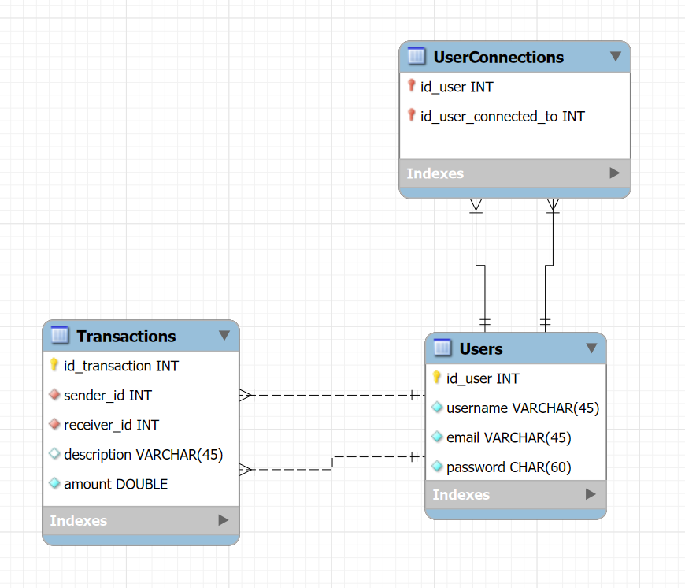

# PayMyBuddy

Application to help people transfer money between them.
Made during the project 6 in the Openclassrooms Java Developer course.

## Get started

- Clone the repository
- Open in your favourite IDE
- Run `P6PayMyBuddyApplication`

## Data structure

*Created with MySQL Workbench*